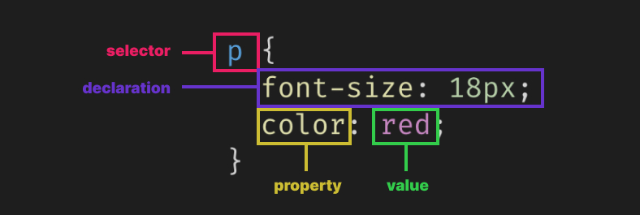

# Introduction

Cascading Style Sheets (**CSS** for short) is a language used to specify how Web pages are presented to users. It lets us style and layout our content, allowing us to create great-looking Web pages.

In the previous lessons we added content to our HTML page. We can see that some elements have a certain look to them - headings are in bold and are larger than the paragraphs. Different heading levels also have different font sizes. These are very basic styles provided by browser by default to make our content readable even if don't specify any custom styling.

## Syntax

CSS is a rule-based language. CSS code is composed of rules specifying groups of styles that should be applied to particular elements on our Web page. Let's explore the different part of a CSS rule:



- **selector**: This _selects_ the HTML element that we want to style, in this case our styles will apply to all `<p>` elements.
- **property**: The characteristic of the HTML element that we want to change, such as its color or the size of its text.
- **value**: The new value that we want for the element's characteristic.
- **declaration**: Comprised of the pair of property and value, separated by a colon `:`.
- **rule**: Comprised of the selector, followed by one or more declarations inside curly braces `{` `}`.

A CSS stylesheet will contain many rules, written one after the other.

```css
h1 {
  color: red;
  font-size: 42px;
}

p {
  color: yellow;
}
```

As we write CSS, we'll find that some properties and values are easy to learn and remember, whereas others we will need to look up a lot. That's completely normal.

The styles in the example above will be applied to all `<h1>` and `<p>` elements on our page. If we want to style only the `<h1>` elements that are inside a `<div>` element, we do that like this:

```css
div h1 {
  color: red;
}
```

We start with the selector for the parent element (`div`), followed by a space, then the selector for the element that we want to style (`h1`). With this, other `<h1>` elements that are not inside a `<div>` will not be affected by this CSS rule.

In most Web pages, elements like `<h1>` or `<p>` can be used multiple times in different contexts that require them to be styled differently, so knowing how to select only specific instances of `<h1>` or `<p>` is very helpful. Later, we will see other ways to do achieve this.

## Additional Links

- [What is CSS?](https://developer.mozilla.org/en-US/docs/Learn/CSS/First_steps/What_is_CSS)
- [Getting started with CSS](https://developer.mozilla.org/en-US/docs/Learn/CSS/First_steps/Getting_started)
- [CSS Reference](https://cssreference.io/)
