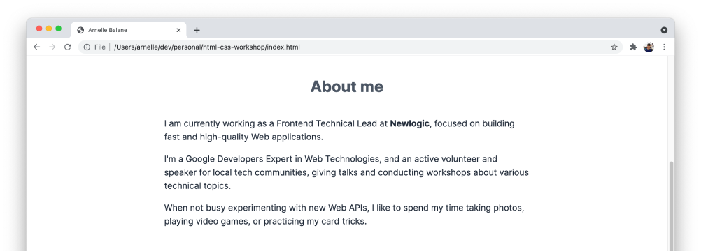
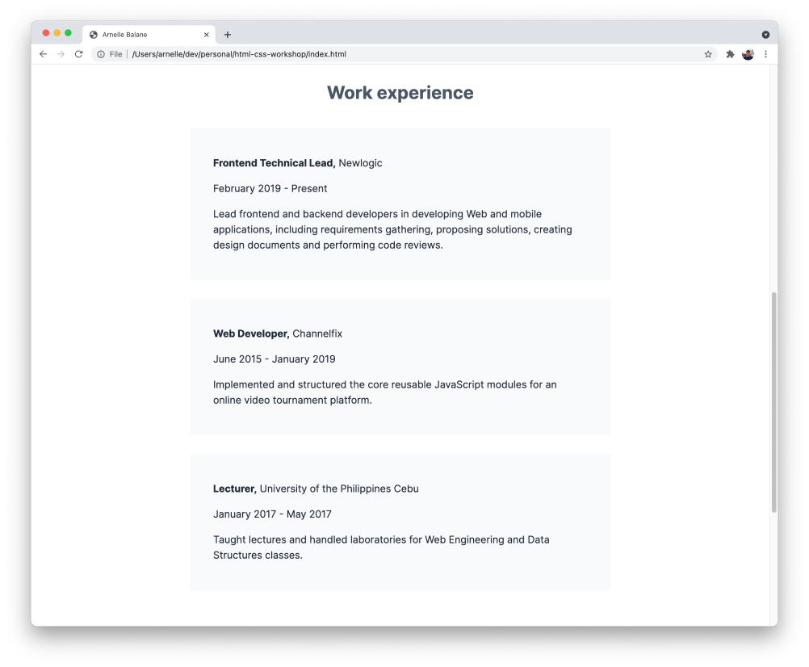

# Block and Inline Elements

> Author's note: This is supposed to be a topic under the HTML section, but I wanted us to learn a bit of CSS first before we discuss this, that's why it's here. Please excuse this little disorganization. Let's carry on 😂

In HTML, elements can either be a **block-level element** or **inline element** depending on how they flow on the page.

## Block-Level Elements

Block-level elements have the following characteristics:

- They take up as much horizontal space as possible by default
- They start a new line on the page
- They stack below each other down the page
- They may contain inline elements or other block-level elements

The elements we've used so far in this workshop have all been block-level elements, and they also have the above characteristics.

- Before we added our custom styling to our page, the headings, paragraphs, and other elements spanned the entire width of our page
- Each heading and paragraph started on a new line, and are stacked below each other

Here's a [list of block-level elements](https://developer.mozilla.org/en-US/docs/Web/HTML/Block-level_elements#elements).

## Inline Elements

Inline elements have the following characteristics:

- They only occupy just enough space to contain the element contents
- They don't force content to start in a new line
- They may only contain data or other inline elements
  - The only exception to this is the `<a>` element which we use to create links. Links can be wrapped around block-level elements. We will learn about links in a later lesson.
- They are not affected by width, height, and vertical margin styles

Here's a [list of inline elements](https://developer.mozilla.org/en-US/docs/Web/HTML/Inline_elements#list_of_inline_elements).

## Updating Our HTML Code

Let's implement some more changes to our HTML page based on our [design reference](/getting-started/personal-portfolio#design-reference) using block-level and inline elements. Based on the **03 - Block and Inline** page in Figma, we want to add these changes:

- Our name in the intro section needs to be in its own line, with a different color
- In the **About me** section, let's emphasize some text by making them bold
- In each work experience item, only the job title should be in bold

### Intro section changes

In order to put our name into its own line, we need to wrap it inside a block-level element, like a `<div>`. Edit this content in our `index.html` file:

```html
<h1>
  Hi, I am
  <div>Arnelle Balane,</div>
  a Web Developer based out of Cebu, focused on building fast and high-quality applications.
</h1>
```

Then add the corresponding styles to `index.css`:

```css
h1 div {
  margin: 0;
  color: #7c3aed;
}
```


### About me section changes

Let's change any text in our **About me** section to be displayed in bold using the [`<strong>`](https://developer.mozilla.org/en-US/docs/Web/HTML/Element/strong) element.

```html
<p>
  I am currently working as a Frontend Technical Lead at <strong>Newlogic</strong>, focused on building fast and
  high-quality Web applications.
</p>
```



### Work experience item changes

For the work experience titles, we are using the `<h3>` element which is already in bold by default. Let's make it not bold first by adding this in `index.css`:

```css
h3 {
  font-weight: normal;
}
```

And then wrapping the job title part of the work experience inside the `<strong>` element in `index.html`:

```html
<article>
  <h3><strong>Frontend Technical Lead,</strong> Newlogic</h3>
  <p>February 2019 - Present</p>
  <p>
    Lead frontend and backend developers in developing Web and mobile applications, including requirements gathering,
    proposing solutions, creating design documents and performing code reviews.
  </p>
</article>

<article>
  <h3><strong>Web Developer,</strong> Channelfix</h3>
  <p>June 2015 - January 2019</p>
  <p>Implemented and structured the core reusable JavaScript modules for an online video tournament platform.</p>
</article>

<article>
  <h3><strong>Lecturer,</strong> University of the Philippines Cebu</h3>
  <p>January 2017 - May 2017</p>
  <p>Taught lectures and handled laboratories for Web Engineering and Data Structures classes.</p>
</article>
```



## Changing Levels

HTML elements are either block-level or inline by default. However, it is possible to force an element to be block-level or inline using the CSS [`display`](https://developer.mozilla.org/en-US/docs/Web/CSS/display) property.

We are using a `<div>` to place our name in the intro section into its own line. Let's change it into a [`<span>`](https://developer.mozilla.org/en-US/docs/Web/HTML/Element/span) element which is an inline element by default:

```html
<h1>
  Hi, I am <span>Arnelle Balane,</span> a Web Developer based out of Cebu, focused on building fast and high-quality
  applications.
</h1>
```

Then replace our styles for `h1 div` to instead select `h1 span`, and then make it a block-level element:

```css
h1 span {
  display: block;
  color: #7c3aed;
}
```

This gives us the exact same result compared to before we made any changes.

We can also set `display: inline;` to any element's styles to make it an inline element.

## Inline-Block

We learned earlier that inline elements are not affected by width, height, and vertical margin styles. If we want to keep an element inline and still be able to style its with, height, or vertical margins, we can apply this CSS to it:

```css
strong {
  display: inline-block;
}
```

We will use this on our page in a later lesson.

## Additional Links

- [Complete code for HTML file](https://github.com/arnellebalane/skourse-html-css-workshop/blob/05-block-inline/index.html)
- [Complete code for CSS file](https://github.com/arnellebalane/skourse-html-css-workshop/blob/05-block-inline/index.css)
- [Block-level elements](https://developer.mozilla.org/en-US/docs/Web/HTML/Block-level_elements)
- [Inline elements](https://developer.mozilla.org/en-US/docs/Web/HTML/Inline_elements)
- [Block and Inline Elements](http://web.simmons.edu/~grovesd/comm244/notes/week4/block-inline)
