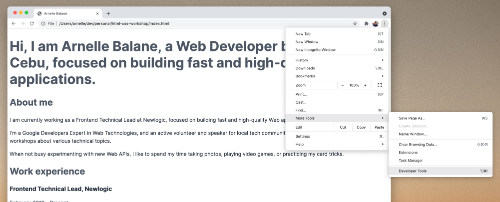
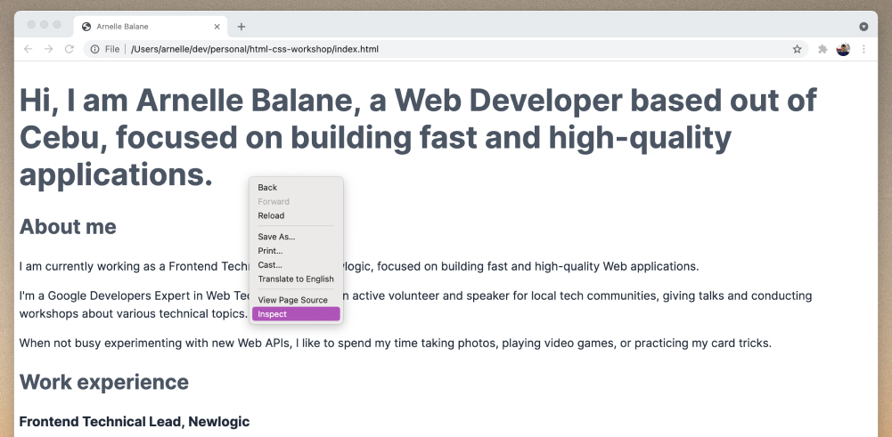
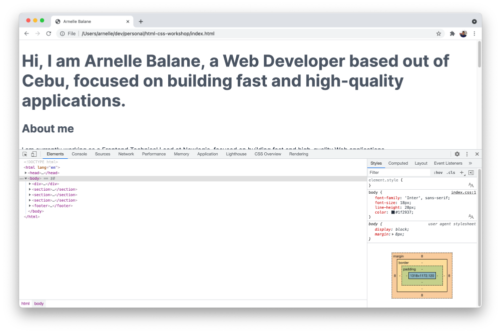
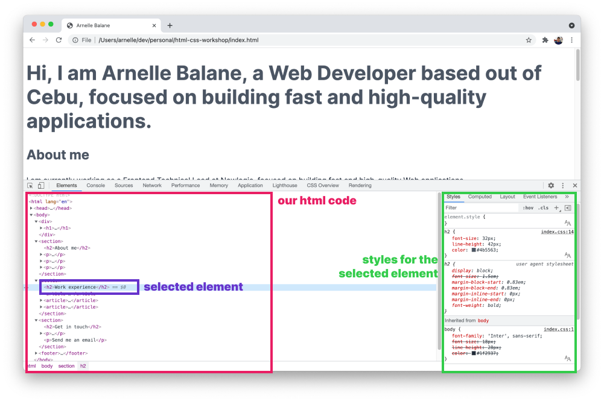

# Introducing DevTools

Before we proceed, let's first learn a little bit about Chrome DevTools. It is a developer tool built into Google Chrome (other browsers also have their own devtools that offer similar features).

One of its many features is to allow us to view the HTML elements and corresponding styles that are displayed on the page.

There are many ways to open Chrome DevTools:

1. In the "three dots" menu, go to "More Tools", and then "Developer Tools"

   

1. Right click anywhere on the page, then click on "Inspect"

   

1. Use the keyboard shortcut
   - `Cmd + Option + I` on macOS
   - `Ctrl + Shift + I` on Windows

Regardless of which method we use, the Chrome DevTools panel should appear on our browser.

## The Elements Panel

For this workshop, we are only interested in the **Elements** panel. This shows us all the HTML elements that are rendered on the page, as well as the styles that are applied to that element. It is very helpful in figuring out why some elements look a certain way, as well as inspecting the boundaries of the elements.

As we learn more Web development skills, we'll also find the other panels in Chrome DevTools very useful. For now, the **Elements** panel is all we need.

## Additional Links

- [Chrome DevTools Documentation](https://developer.chrome.com/docs/devtools/)
