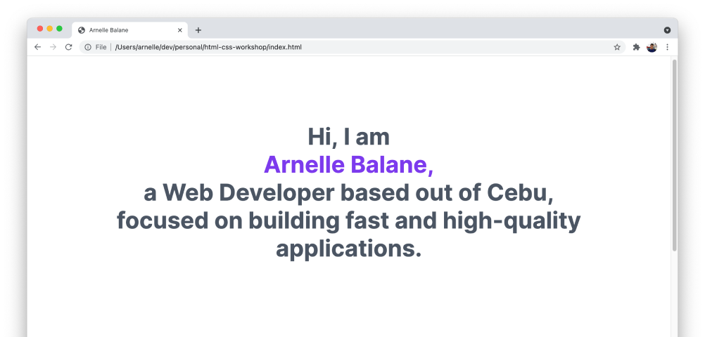
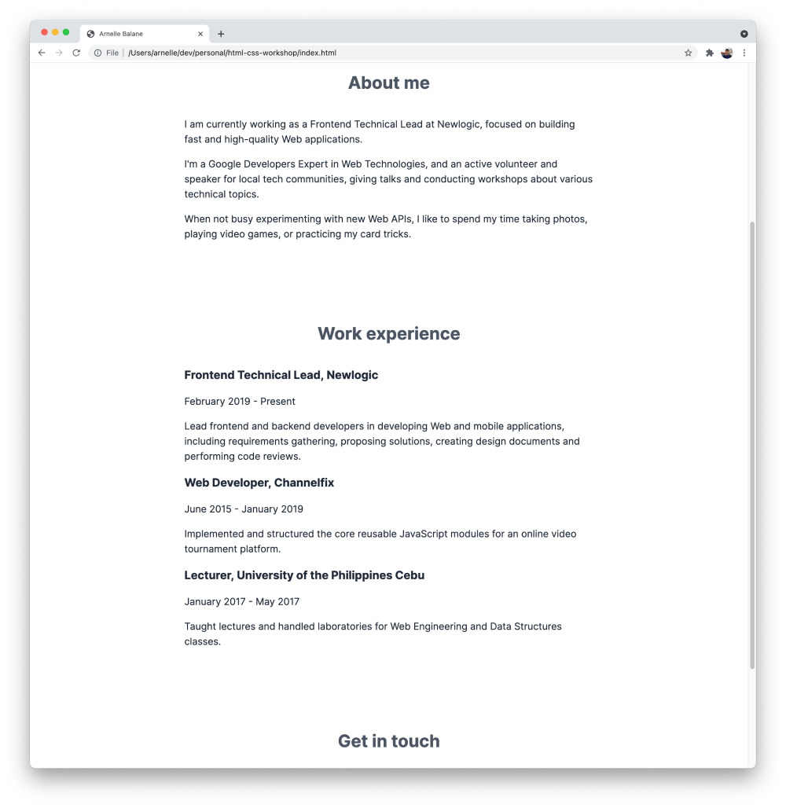
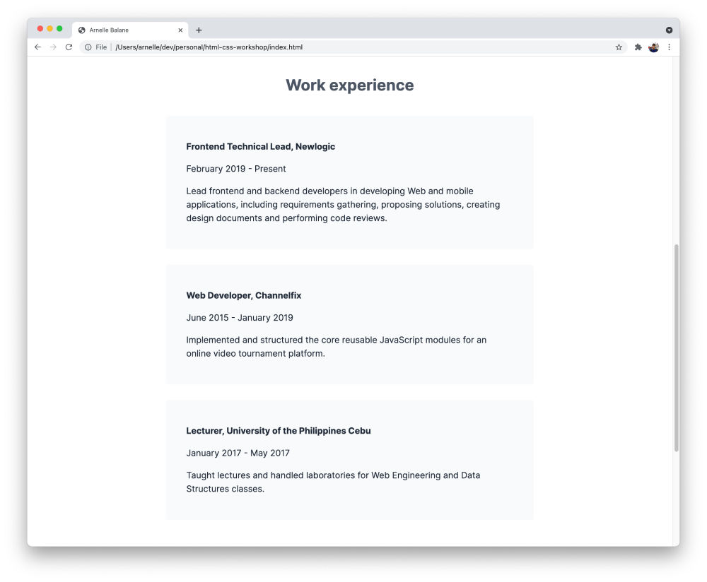

# Styling Our Page's Boxes

Equipped with our recent understanding of the CSS box model, let's now start styling the different elements on our page by modifying the different areas of their boxes.

We will do it by group of content, and we will refer to the **02 - Box Model** page on our [design reference](https://www.figma.com/community/file/1021339027541178065/Skourse---HTML-%26-CSS-Workshop) to determine what values for the paddings, margins, etc. to use.

## Intro Section

Our intro section is the `<div>` element and the `<h1>` element inside it. It has a certain width, is centered on the page, and has some spacing from the top of the page and from the next section.

In our `index.css` file, let's add the following code:

```css
div {
  max-width: 1000px;

  padding-left: 24px;
  padding-right: 24px;
  margin-top: 150px;
  margin-bottom: 150px;
  margin-left: auto;
  margin-right: auto;

  text-align: center;
}
```

We are using `max-width` here so that if the user resizes their browser to less than 1000px in width, the content will still adjust automatically to fit on the page.

Setting both `margin-left` and `margin-right` properties to `auto` places the element horizontally-centered on the page. This only centers the `<div>`, but not the alignment of the text inside it. The [`text-align`](https://developer.mozilla.org/en-US/docs/Web/CSS/text-align) centers any text content inside it.



## Other Sections

We repeat the same process above for the other sections of our page - **About me**, **Work experience**, and **Get in touch**. They are all using the `<section>` element already, which makes it easy to style them all at once.

```css
section {
  max-width: 760px;

  padding-left: 24px;
  padding-right: 24px;
  margin-top: 150px;
  margin-bottom: 150px;
  margin-left: auto;
  margin-right: auto;
}
```

Same as before, this gives the sections a maximum width, centers them on the page, and gives some space above and below it.

For the section titles, they need to be centered, and there's also some space below it before the paragraphs. Let's add the following styles for the `<h2>` element (we've already added some styles for `<h2>` before, so just combine these with that).

```css
h2 {
  margin-bottom: 42px;
  text-align: center;
}
```



## Work Experience Items

Next, let's style the work experience items based on our design reference. It has the following characteristics:

- it has a background color
- it has some padding to give space between the actual content and the edge of the element
- it has a slightly-rounded corner

Let's translate that into CSS code, by styling the `<article>` element which we are using to represent each work experience:

```css
article {
  padding-top: 32px;
  padding-bottom: 32px;
  padding-left: 42px;
  padding-right: 42px;
  margin-bottom: 32px;
  border-radius: 5px;

  background-color: #f9fafb;
}
```



## Page Footer

Finally, let's style the footer of our page. Unlike the other sections, our `<footer`> element occupies the entire width of the page and just centers the text inside it. This is how we can do that with CSS:

```css
footer {
  padding-top: 42px;
  padding-bottom: 42px;
  padding-left: 24px;
  padding-right: 24px;

  text-align: center;
  background-color: #f9fafb;
}
```

The `<p>` element inside it also needs some styling to subtly change its color and also remove its margins which is making the `<footer>` taller than it should be:

```css
footer p {
  margin-top: 0;
  margin-bottom: 0;

  color: #4b5563;
}
```

Note how we're using `footer p` as our selector to make sure that we only apply the styles for the paragraph inside our page's footer instead of to all the `<p>` elements on the page.


We can also see that the page footer doesn't entirely reach the left, right, and bottom edges of our page. This is because the `<body>` element has some default margin around it that's provided by the browser. In most cases when we're applying our custom styles for an HTML page, we can just get rid of this margin.

```css
body {
  margin: 0;
}
```

It's also completely alright to leave it as-is if it's not directly impacting the page design that we're implementing.

At this point, our page now starts to look closer to our goal, with the centered sections, background colors, and proper spacing between the elements.

## Additional Links

- [Complete code for HTML file](https://github.com/arnellebalane/skourse-html-css-workshop/blob/04-box-model/index.html)
- [Complete code for CSS file](https://github.com/arnellebalane/skourse-html-css-workshop/blob/04-box-model/index.css)
