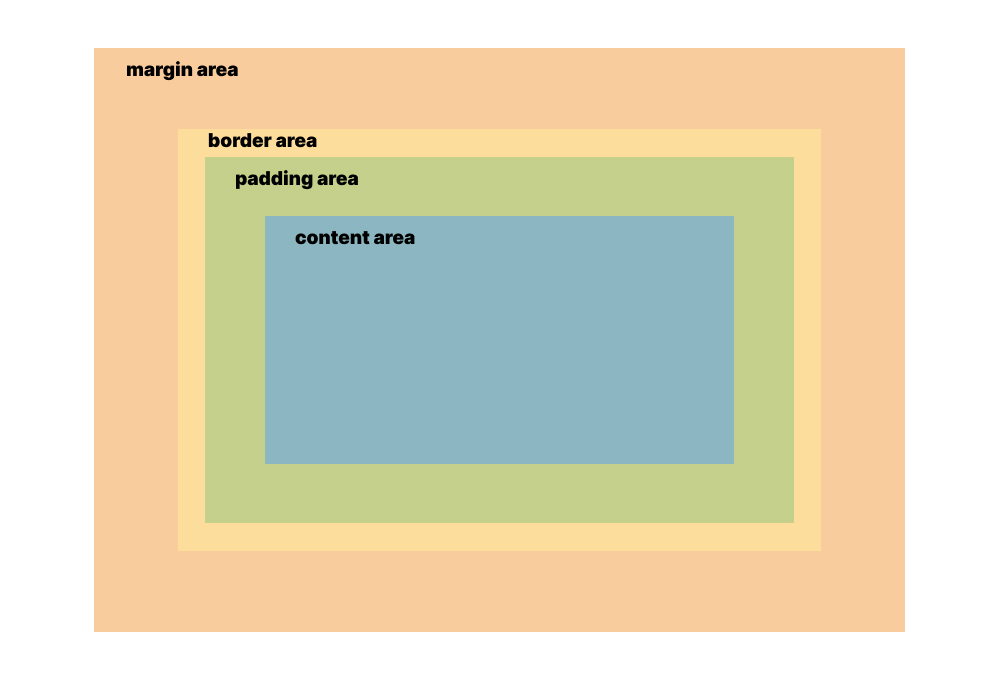

# The Box Model

When browsers render our page, they represent every element as a rectangular box. They may appear to have different shapes, like slanted or rounded, but underneath they are all bound inside a rectangular box. A good portion of what we do when styling with CSS is manipulating these rectangular boxes, like changing their dimensions or spacing between other boxes.

Every rectangular box is composed of four areas that we can modify individually: the **content area**, **padding area**, **border area**, and **margin area**.



## Content Area

The **content area** contains the "real" content of the element, such as the text or image that it represents. Its size automatically fits the size of the element's contents, but can be explicitly overriden with CSS.

Here are the CSS properties that affect the size of the element's content area:

- [`width`](https://developer.mozilla.org/en-US/docs/Web/CSS/width)
- [`height`](https://developer.mozilla.org/en-US/docs/Web/CSS/height)
- [`min-width`](https://developer.mozilla.org/en-US/docs/Web/CSS/min-width)
- [`min-height`](https://developer.mozilla.org/en-US/docs/Web/CSS/min-height)
- [`max-width`](https://developer.mozilla.org/en-US/docs/Web/CSS/max-width)
- [`max-height`](https://developer.mozilla.org/en-US/docs/Web/CSS/max-height)


## Padding Area

The **padding area** is the the space between the content area and the edge of the element. This area is transparent, but we know that it's there based on the spacing between the content and the edge of the element.

Here are the CSS properties that affect the size of the element's padding area:

- [`padding-top`](https://developer.mozilla.org/en-US/docs/Web/CSS/padding-top)
- [`padding-right`](https://developer.mozilla.org/en-US/docs/Web/CSS/padding-right)
- [`padding-bottom`](https://developer.mozilla.org/en-US/docs/Web/CSS/padding-bottom)
- [`padding-left`](https://developer.mozilla.org/en-US/docs/Web/CSS/padding-left)
- [`padding`](https://developer.mozilla.org/en-US/docs/Web/CSS/padding)


## Border Area

The **border area** is the edge of the element itself. It's usually not visible by default, but with some CSS we can show it to provide a border around the element's boundaries.

Here are the CSS properties that affect the size of the element's border area:

- [`border-top-width`](https://developer.mozilla.org/en-US/docs/Web/CSS/border-top-width)
- [`border-top-style`](https://developer.mozilla.org/en-US/docs/Web/CSS/border-top-style)
- [`border-top-color`](https://developer.mozilla.org/en-US/docs/Web/CSS/border-top-color)
- [`border-right-width`](https://developer.mozilla.org/en-US/docs/Web/CSS/border-right-width)
- [`border-right-style`](https://developer.mozilla.org/en-US/docs/Web/CSS/border-right-style)
- [`border-right-color`](https://developer.mozilla.org/en-US/docs/Web/CSS/border-right-color)
- [`border-bottom-width`](https://developer.mozilla.org/en-US/docs/Web/CSS/border-bottom-width)
- [`border-bottom-style`](https://developer.mozilla.org/en-US/docs/Web/CSS/border-bottom-style)
- [`border-bottom-color`](https://developer.mozilla.org/en-US/docs/Web/CSS/border-bottom-color)
- [`border-left-width`](https://developer.mozilla.org/en-US/docs/Web/CSS/border-left-width)
- [`border-left-style`](https://developer.mozilla.org/en-US/docs/Web/CSS/border-left-style)
- [`border-left-color`](https://developer.mozilla.org/en-US/docs/Web/CSS/border-left-color)

Most of the time we'll be using the shorthand versions of these properties:

- [`border-top`](https://developer.mozilla.org/en-US/docs/Web/CSS/border-top)
- [`border-right`](https://developer.mozilla.org/en-US/docs/Web/CSS/border-right)
- [`border-bottom`](https://developer.mozilla.org/en-US/docs/Web/CSS/border-bottom)
- [`border-left`](https://developer.mozilla.org/en-US/docs/Web/CSS/border-left)
- [`border`](https://developer.mozilla.org/en-US/docs/Web/CSS/border)

We can also make the border appear rounded using the [`border-radius`](https://developer.mozilla.org/en-US/docs/Web/CSS/border-radius) property.


## Margin Area

The **margin area** is an invisible space beyond the boundaries of the element and is used to separate it from other neighboring elements. Margins can also have negative values, allowing us to overlap elements with each other.

Here are the CSS properties that affect the size of the element's margin area:

- [`margin-top`](https://developer.mozilla.org/en-US/docs/Web/CSS/margin-top)
- [`margin-right`](https://developer.mozilla.org/en-US/docs/Web/CSS/margin-right)
- [`margin-bottom`](https://developer.mozilla.org/en-US/docs/Web/CSS/margin-bottom)
- [`margin-left`](https://developer.mozilla.org/en-US/docs/Web/CSS/margin-left)
- [`margin`](https://developer.mozilla.org/en-US/docs/Web/CSS/margin)


## Overall Element Dimensions

In order to determine the total width of an element with all the CSS applied, we sum the values of `border-left-width`, `padding-left`, `width`, `padding-right`, and `border-right-width`.

In order to determine the total height of an element with all the CSS applied, we sum the values of `border-top-width`, `padding-top`, `height`, `padding-bottom`, and `border-bottom-width`.

Let's say for example we have the following CSS rule:

```css
div {
  width: 100px;
  padding-left: 20px;
  padding-right: 20px;
  border-left: 10px solid red;
  border-right: 10px solid red;
  margin-left: 50px;
  margin-right: 50px;
}
```

This gives us a `<div>` with an overall width of `100px + 20px + 20px + 10px + 10px = 160px`. The margins don't affect the overall element dimensions. This is the standard CSS box model.

The standard box model behavior can get inconvenient when we want to style an element to have a specific overall width or height. Let's say we want to style an element to have exactly `500px` overall width, but if it has paddings or borders we need to subtract those values from `500px` in order to determine what value to set for the `width` property.

To make things a bit more complex, there is also an **alternate box model**, which allows us to set the overall dimensions of the element with `width` or `height`. Any borders or paddings we specify doesn't add to the overall dimensions of the element, but instead removes from the size of the content area.

We can switch to the alternate box model using the [`box-sizing`](https://developer.mozilla.org/en-US/docs/Web/CSS/box-sizing) property. Here it is added to the same code example above:

```css
div {
  box-sizing: border-box;

  width: 100px;
  padding-left: 20px;
  padding-right: 20px;
  border-left: 10px solid red;
  border-right: 10px solid red;
  margin-left: 50px;
  margin-right: 50px;
}
```

Because this is now using the alternate box model, this gives us a `<div>` with an overall width of `100px`. The borders and paddings are subtracted from the overall width to get the width of the content area, which is now just `100px - 20px - 20px - 10px - 10px = 40px`.

## Additional Links

- [Introduction to the CSS basic box model](https://developer.mozilla.org/en-US/docs/Web/CSS/CSS_Box_Model/Introduction_to_the_CSS_box_model)
- [The box model](https://developer.mozilla.org/en-US/docs/Learn/CSS/Building_blocks/The_box_model)
