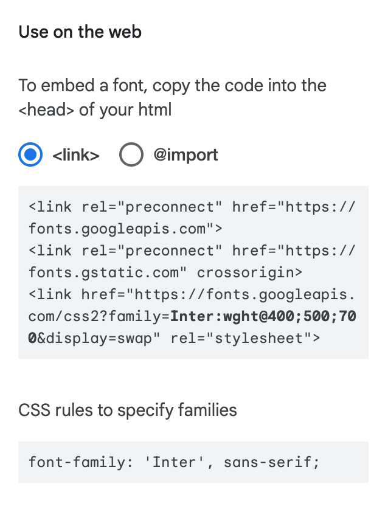
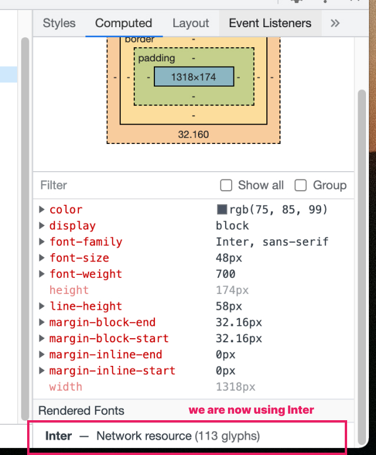

# Using Custom Fonts

In the previous lesson we set the page's font to the default sans serif font, which could be anything depending on the operating system. We can also specify what font we want to use instead of using the default, by providing the name of the font to the `font-family` property.

Let's say we want to use the **Open Sans** font in our page, then we would do:

```css
body {
  font-family: 'Open Sans';
}
```

We can also provide multiple font names by separating each name with a comma:

```css
body {
  font-family: 'Open Sans', 'Verdana', sans-serif;
}
```

When doing this, the fonts will act as a fallback to each other - if Open Sans is not available (e.g. not installed on the user's device), then try Verdana, and if that's also not available then use the default sans serif font.

## Using Google Fonts

We can't always assume that a font is installed on the users' devices. If we take a look at our [design reference](/getting-started/personal-portfolio#design-reference), we are using a font called [**Inter**](https://rsms.me/inter/). This is most likely not installed on users' devices.

We can load custom fonts into the users' devices so that they see our page in the font that we want. One service where we can load fonts from is [Google Fonts](https://fonts.google.com/).

1. Go to [Google Fonts](https://fonts.google.com/)
1. Search for "Inter" in the search box (or really, whatever font that we like to use)
1. Click on the result to go to [Inter's detail page](https://fonts.google.com/specimen/Inter?query=Inter)
1. Select the styles that we want to use
   - For the purpose of this workshop, we need **Regular 400**, **Medium 500**, and **Bold 700**
1. After selecting the styles, a panel should open on the right side providing guidance on how to use the font in our Web projects



In `index.html`, add the following code inside the `<head>` element, just before the line that loads `index.css`:

```html
<link rel="preconnect" href="https://fonts.googleapis.com" />
<link rel="preconnect" href="https://fonts.gstatic.com" crossorigin />
<link rel="stylesheet" href="https://fonts.googleapis.com/css2?family=Inter:wght@400;500;700&display=swap" />
```

In `index.css`, we set "Inter" as our `font-family` value, falling back to `sans-serif`:

```css
body {
  font-family: 'Inter', sans-serif;
}
```

If we refresh our page, we'll can notice that the font is now different. It should now be the **Inter** font. We can confirm this through Chrome DevTools, under the **Computed** styles tab.



## Additional Links

- [Complete code for HTML file](https://github.com/arnellebalane/skourse-html-css-workshop/blob/03-styles/index.html)
- [Complete code for CSS file](https://github.com/arnellebalane/skourse-html-css-workshop/blob/03-styles/index.css)
