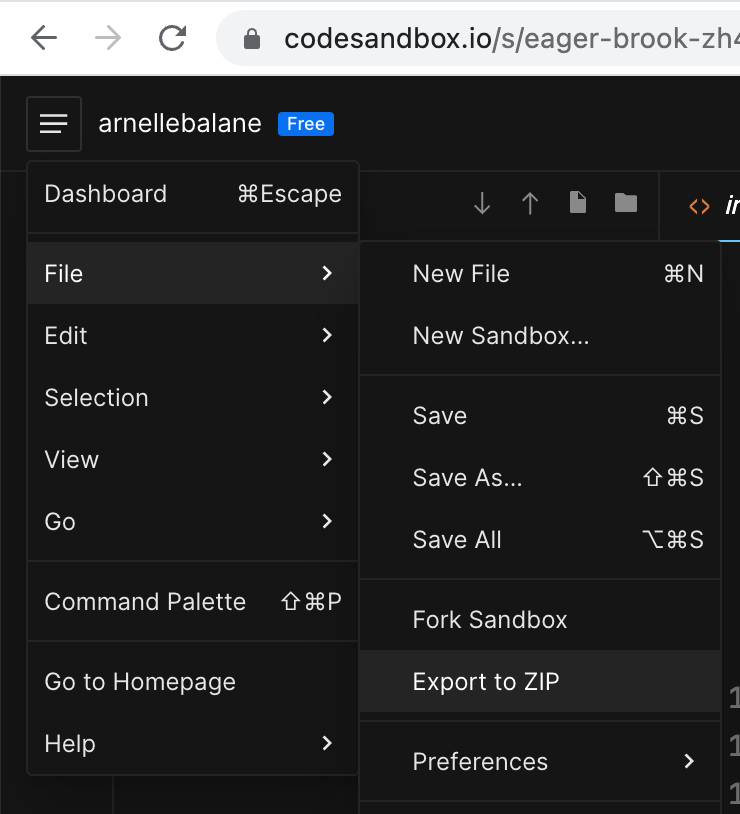
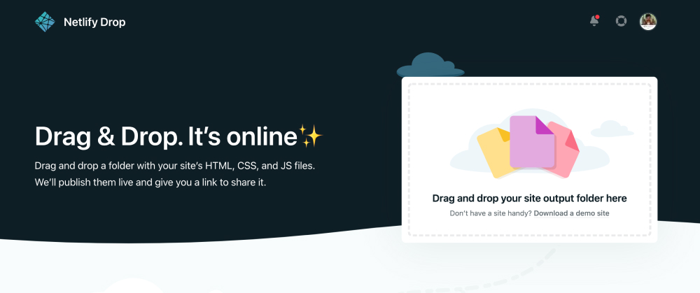
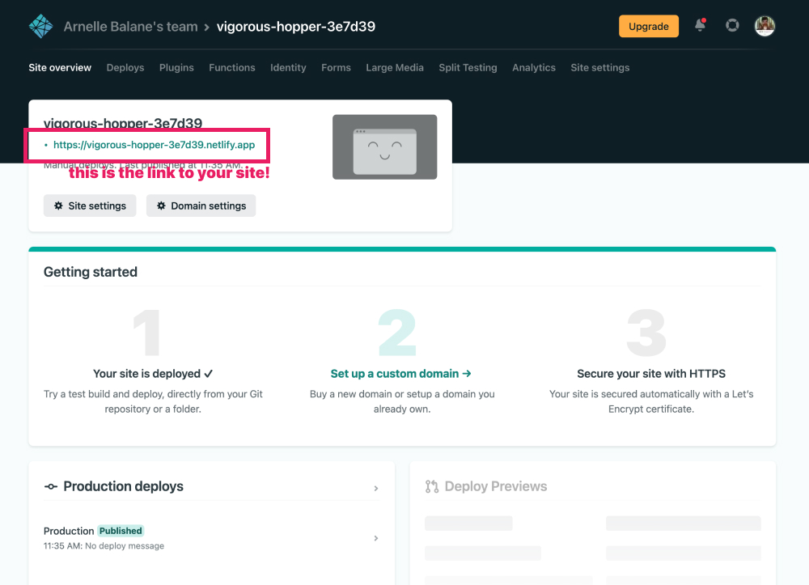
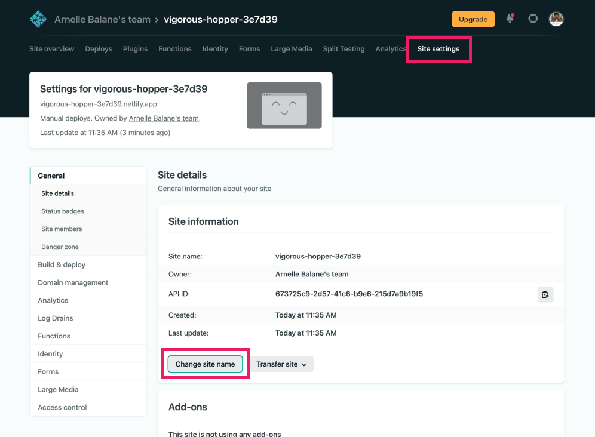

# Deployment

Congratulations! At this point we are now done building our personal portfolio sites. Our code is still on our computers though and is not yet accessible through the Internet.

The next thing that we will do is deploy our site so that our friends and family can see how good we are at coding HTML and CSS.

## Download CodeSandbox Files

> These instructions are only applicable if we are using CodeSandbox to code along during the workshop.

In order to prepare our site for deployment, we need to download our code into our computer first.

1. Visit [codesandbox.io](https://codesandbox.io/) and login
1. Open the sandbox project created earlier
1. Go to the menu icon at the top-left corner of the screen, then **File**, then **Export to ZIP**

   

1. Extract the downloaded ZIP file, the extracted folder will be our project folder that we will deploy in the next step

## Deploying to Netlify

Netlify is a platform that lets us deploy HTML and CSS sites for free, among all the amazing features that they offer.

1. Visit [netlify.com](https://app.netlify.com/signup) and sign up for an account (or login if we have one already)
1. Visit [netlify.com/drop](https://netlify.com/drop)
1. Drag and drop our our project folder into the page

   

1. Wait for the deploy to finish, then visit the URL to see your live site!

   

1. We can customize the name and URL of our site from the **Site Settings** page

   
