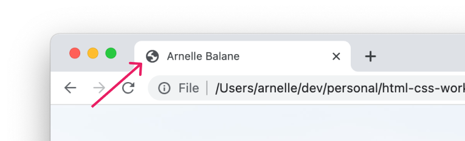
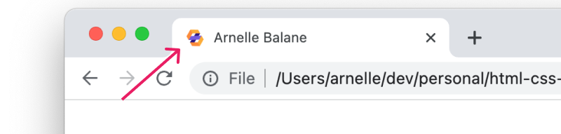

# Favicons

When we open a site on our browser, we can see a little icon in the browser tab, like this:



That is called a **favicon**, and we can change that to anything we want that better represents our site by adding this HTML inside the `<head>` element, after we load `index.css`:

```html
<link
  rel="icon"
  href="https://res.cloudinary.com/arnellebalane/image/upload/v1632525392/html-css-workshop/favicon_w9xgxm.png"
/>
```


