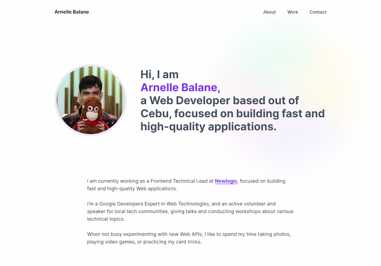
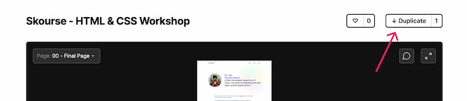

# Personal Portfolio

For this workshop, we are going to build our personal portfolio site. We will build it step-by-step, learning one concept at a time, until we implement the entire site.

At the end of this workshop, not only are we going to have enough skills to build more Web pages, we will also have a personal portfolio site that we can share to showcase our skills.

## Design Reference

The design for our personal portfolio project is available in Figma. Referencing the design allows us to inspect specific styles for texts, spacing, colors, and others for our Web page.

1. Go to [Figma](https://figma.com/) and login to your account (or register if you don't have one yet)
2. Visit the [Skourse - HTML & CSS Workshop](https://www.figma.com/community/file/1021339027541178065/Skourse---HTML-%26-CSS-Workshop) community resource
3. Click on the "Duplicate" button to copy the design into your Figma account
   
4. In future steps, we will keep referencing this design to get certain values to style our Web page
