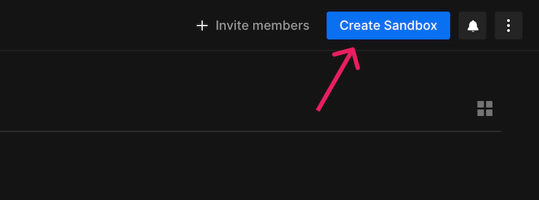
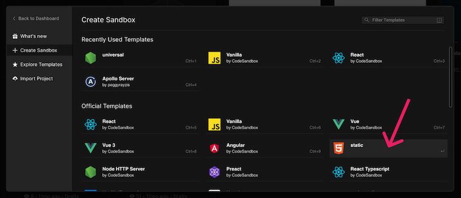
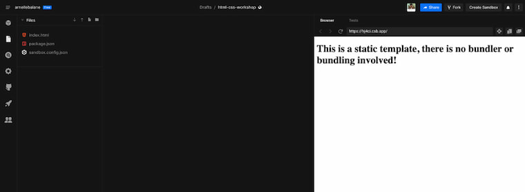

# Using CodeSandbox

If you don't want to install any applications into your computer for now, you can still code along the workshop through CodeSandbox.

[CodeSandbox](https://codesandbox.io/) is an a Web application that allows us write code directly on our browser without requiring us to install anything on our computer.

To get started with CodeSandbox, go to [codesandbox.io](https://codesandbox.io/) and create an account for free. You may sign in using your Google or GitHub account.

## Create a sandbox

Once logged in, click on the "Create Sandbox" button to create a new CodeSandbox project.

In the popup that appears, choose the `static` template for our sandbox.

We will then see our code editor after our project is created.

Feel free to rename the project, for uniformity let's call it `html-css-workshop`.

CodeSandbox also created some initial files for us. Make sure you don't delete them for now as they are essential for CodeSandbox to work.

Now that we're set up, we can now start coding!
