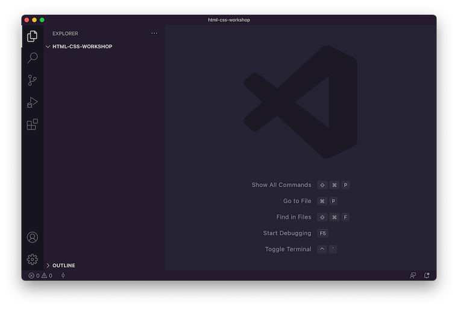

# Using your local environment

Coding directly on our computer is the recommended way of following along to this workshop. Setting up our local environment now also prepares us for future Web development projects that we will work on.

## Install applications

For this workshop, we will need to install these applications:

1. [Visual Studio Code](https://code.visualstudio.com/)
2. A Web browser (we probably already have at least one of these)
   - [Google Chrome](https://www.google.com/chrome/)
   - [Mozilla Firefox](https://www.mozilla.org/en-US/firefox/new/)
   - [Microsoft Edge](https://www.microsoft.com/en-us/edge)
   - As a Web developer, it is important that we test our Web applications on multiple browsers to ensure that they work for the most number of users regardless of the browser that they use

## Create project folder

Let's then create a folder where we will place all our code for this workshop. We can create this folder anywhere in we want. We can also name the folder whatever we want. For uniformity, let's just say we created it in our desktop folder and named it `html-css-workshop`.

After creating the project folder, open Visual Studio Code and drag and drop our project folder into the code editor. The Visual Studio Code window should look something like this:

Our local environment is now set up. We can now start coding!
