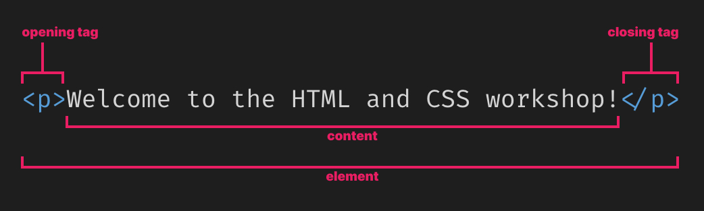
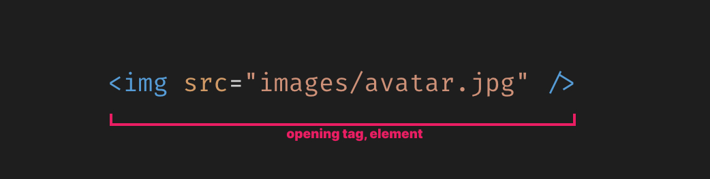
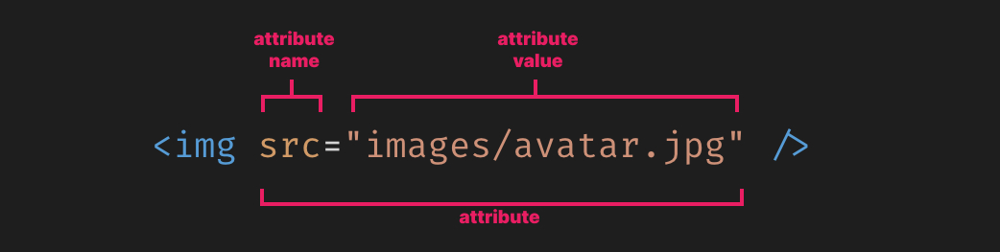

# Introduction

HyperText Markup Language (**HTML** for short) is the most basic building block of the Web. It defines the content, meaning, and structure of Web content.

"Hypertext" refers to links that connect Web pages to each other, either within a single website or across multiple websites. Links are a fundamental aspect of the Web, and these network of inter-connected Web pages forms the World Wide Web.

HTML uses "markup" to annotate text, images, and other content to be displayed in a Web page. These markup includes elements such as `<body>`, `<div>`, `<span>`, `<p>`, ``, and many others. We will learn about some of these elements throughout this workshop.

## Syntax

HTML code is composed of different elements that represent different types of content. Let's explore the different parts of an HTML element:



- **opening tag**: Consists of the name of the element (in this case, `p`), indicates where the element begins.
- **closing tag**: Similar to the opening tag, except with a forward slash `/` before the element name, indicates where the element ends.
- **content**: The content of this element (in this case, it's just text).
- **element**: The opening tag, closing tag, and content together comprise the element.

### Empty Elements

There are several HTML elements that don't require a closing tag. We call them **empty elements**, and they look like this:



In empty elements, the opening tag is the entire element itself (we usually call it a "self-closing tag"). Because they have no closing tag, empty elements also cannot have any content.

### Attributes

In the last image, we can see that there are additional code inside the angle brackets other than the element name. We call them **attributes**.

Attributes may contain additional information that modifies the element's behavior (such as what image to load or where a link should go to). They may also just be used to style that element (such as the `class` attribute, as we will see later).



- **attribute**: There should be a space between the element name and the attribute, and between multiple attributes.
- **attribute name**: Followed by an equal sign `=`
- **attribute value**: Wrapped by quotation marks `"`

There are also several [**boolean attributes**](https://meiert.com/en/blog/boolean-attributes-of-html/) that don't need any value, so only the attribute name is required.

## Nested Elements

Besides text content, HTML elements can also contain other HTML elements. This is called **nesting**.

```html
<p>Welcome to the <em>HTML and CSS Workshop</em></p>
```

- It allows us to apply multiple HTML tags to a single piece of content, for example to italize some part of the text contents of a paragraph (using `<em>` inside `<p>`)
- It allows us to style a group of elements at once.

When nesting elements, it is important that we close the inner elements first. In the example above, notice how the `</em>` closing tag appears the `</p>` closing tag.

## Additional Links

- [HTML: HyperText Markup Language](https://developer.mozilla.org/en-US/docs/Web/HTML)
- [HTML Basics](https://developer.mozilla.org/en-US/docs/Learn/Getting_started_with_the_web/HTML_basics)
- [HTML Reference](https://htmlreference.io/)
