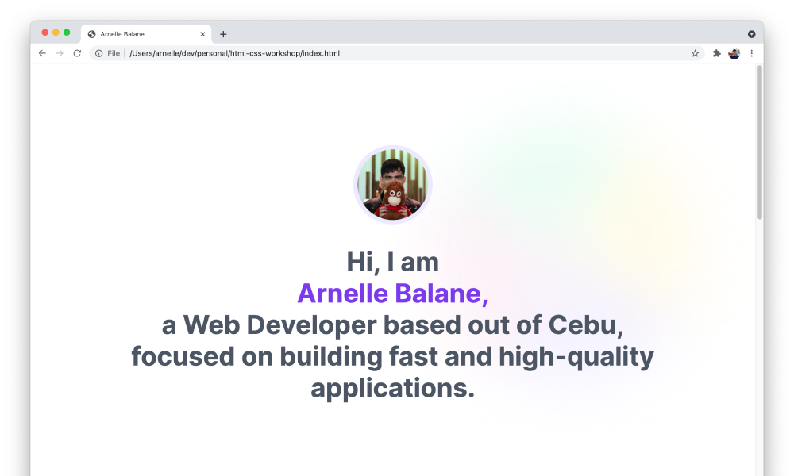
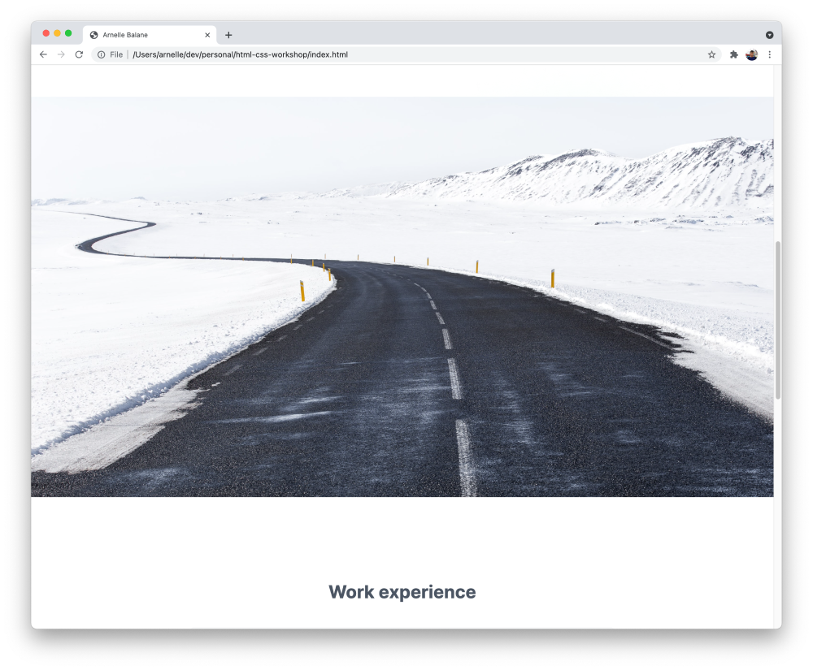

# Using Background Images

In addition to embedding an image directly on a Web page, images can also be set as the background of the page or of specific HTML elements.

## Adding Page Background Image

To apply a background image to the page, we set the [`background-image`](https://developer.mozilla.org/en-US/docs/Web/CSS/background-image) property on the `<body>` element.

```css
body {
  background-image: url('https://res.cloudinary.com/arnellebalane/image/upload/v1632525393/html-css-workshop/gradient-bg_gxrhv1.png');
  background-repeat: no-repeat;
  background-position-x: right;
  background-attachment: fixed;
}
```



## Adding Element Background Image

In the **05 - Images** page of our [design reference](/getting-started/personal-portfolio#design-reference), we can see that we have a big banner image between the **About me** and **Work experience** sections.

We can either load this using the `` element or as a background image. Both are fine, so let's go with the background image for now. First, let's add a `<div>` where we will apply the background image to.

```html
<div class="banner-image"></div>
```

Since it doesn't have any content for now, it will not have any height, so let's give it a fixed height in CSS and then set the background image:

```css
.banner-image {
  height: 720px;

  background-image: url('https://res.cloudinary.com/arnellebalane/image/upload/v1632525395/html-css-workshop/banner_tirxkp.jpg');
  background-size: cover;
  background-attachment: fixed;
}
```



## Additional Links

- [Complete code for HTML file](https://github.com/arnellebalane/skourse-html-css-workshop/blob/08-images/index.html)
- [Complete code for CSS file](https://github.com/arnellebalane/skourse-html-css-workshop/blob/08-images/index.css)
