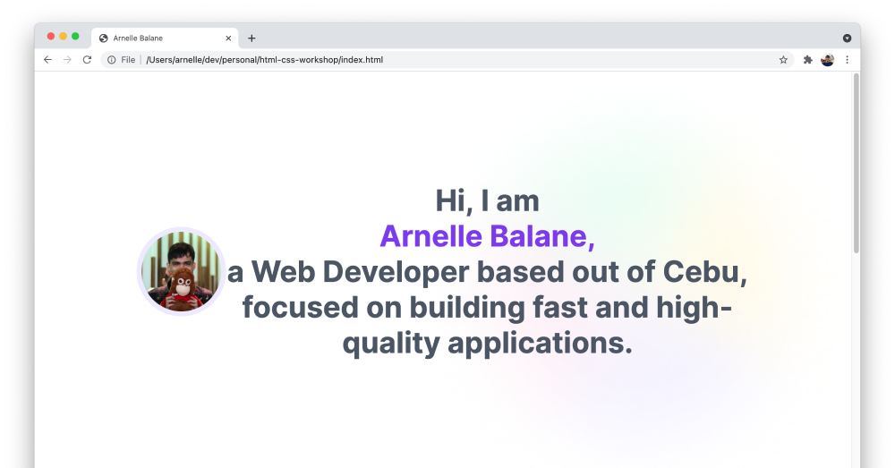
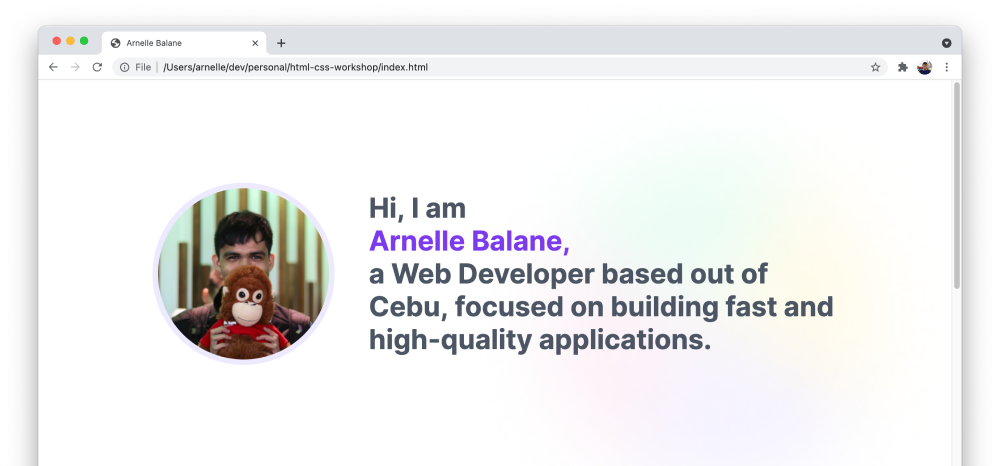

# Custom Layouts

Up to this point, our page layout has just been going from top to bottom, with elements stacking below each other. We've added some margin between elements, and soem padding inside the elements.

In the **06 - Layout** page of our [design reference](/getting-started/personal-portfolio#design-reference), we see our first layout where elements are placed beside each other. To achieve this layout, we can use [CSS Flexbox](https://developer.mozilla.org/en-US/docs/Web/CSS/CSS_Flexible_Box_Layout/Basic_Concepts_of_Flexbox).

Flexbox is a layout model in CSS that places elements next to each other in a certain direction, while also giving control to the alignment and spacing between these elements.

To place our image and intro text next to each other, all we need is a little change to our CSS code:

```css
.intro-section {
  display: flex;
  align-items: center;
}
```

This turns the intro section `<div>` element into a "flex container", and centers its contents vertically.



Easy! Then we just need adjust the alignment, spacing, font size of the intro text, dimensions of the image, etc. based on our design reference.

```css
.intro-section {
  /* text-align: center; */
}

.intro-section img {
  width: 250px;
  height: 250px;
  margin-right: 50px;
}

.intro-section h1 {
  margin: 0;
  font-size: 40px;
  line-height: 48px;
}
```



## Additional Links

- [Basic concepts of flexbox](https://developer.mozilla.org/en-US/docs/Web/CSS/CSS_Flexible_Box_Layout/Basic_Concepts_of_Flexbox)
- [A Complete Guide to Flexbox](https://css-tricks.com/snippets/css/a-guide-to-flexbox/)
