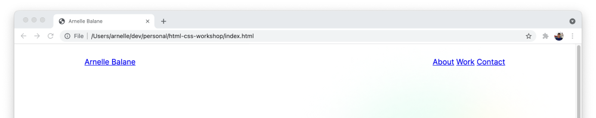
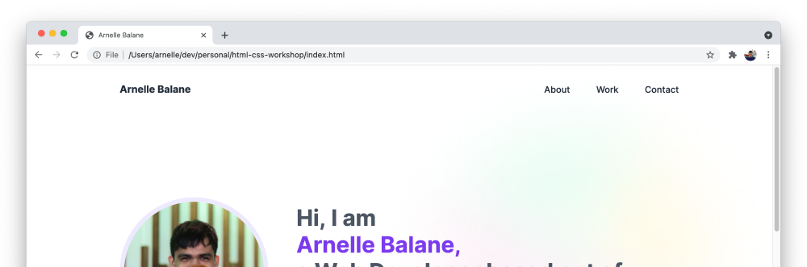

# Add Site Header

Another change in our [design reference](/getting-started/personal-portfolio#design-reference) is the addition of a header for our site, containing the site name and navigation links in the same row with some space between then.

## Add HTML Elements

Edit `index.html` to add the HTML elements that we need to represent our header and navigation links. Let's also add classes to some elements so it's easy to style them after:

```html
<header class="site-header">
  <a href="" class="site-logo">Arnelle Balane</a>

  <nav class="site-nav">
    <a href="">About</a>
    <a href="">Work</a>
    <a href="">Contact</a>
  </nav>
</header>
```

We don't have an about, work, and contact pages to link to but we have corresponding sections for them in our current page. What we can do is scroll into the appropriate section of the page based on which navigation link was clicked. This behavior requires that our sections have an `id` attribute, so let's add one to each of them:

```html
<section id="about" class="section about-section">
  ...
</section>

<section id="work" class="section work-section">
  ...
</section>

<section id="contact" class="section contact-section">
  ...
</section>
```

Then we use the `id` of each section as the `href` value of their corresponding navigation link, prefixed with a `#`.

```html
<a href="#about">About</a>
<a href="#work">Work</a>
<a href="#contact">Contact</a>
```

## Style Header Element

Then let's layout the header contents next, using Flexbox to place them horizontally and add some space between them.

```css
.site-header {
  display: flex;
  justify-content: space-between;
  align-items: center;

  max-width: 1000px;
  height: 86px;
  padding: 0 24px;
  margin: 0 auto;
}
```



We now get the general header layout right. Next we style the contents of the header - the site logo and the navigation links.

## Style Header Contents

Here are the styles for the site logo:

```css
.site-logo {
  margin: 0;

  font-size: 18px;
  font-weight: bold;
  text-decoration: none;
  color: #1f2937;
}
```

And here are the styles for the navigation links:

```css
.site-nav a {
  margin-left: 42px;

  font-size: 16px;
  font-weight: 500;
  text-decoration: none;
  color: #1f2937;
}
```

Now we get a site header that looks the same as the design reference.



## Smooth Scrolling

Clicking on the navigation links in the header makes the page jump instantly to the corresponding page section. We can make this more pleasing by enabling smooth scrolling for our page:

```css
html {
  scroll-behavior: smooth;
}
```

The page also scrolls in a way that the top edge of the section is aligned with the top edge of the browser, which can be a bit awkward to look at. Let's offset this by changing the section margins into paddings:

```css
.section {
  max-width: 760px;
  padding: 150px 24px;
  margin: 0 auto;
}

.contact-section {
  margin-bottom: 150px;
}
```

## Additional Links

- [Complete code for HTML file](https://github.com/arnellebalane/skourse-html-css-workshop/blob/09-layout/index.html)
- [Complete code for CSS file](https://github.com/arnellebalane/skourse-html-css-workshop/blob/09-layout/index.css)
