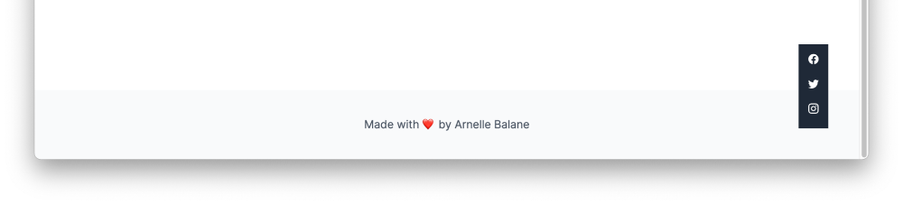

# Fixed Position

Earlier we learned that elements in an HTML page flow in a certain way: block-level elements take up all available space and stack below each other, and inline elements take just enough space needed by its content.

Sometimes, there will be cases where we want an element to break out of the normal document flow and do its own thing, like stick to the corner of the page and remain there even if we scroll on the page.

In the **07 - Position** page of our [design reference](/getting-started/personal-portfolio#design-reference), we see an example of an element that does that - a group of links to our social media accounts. Let's add that to our page now.

## Add HTML Elements

Let's first add the necessary HTML elements to represent our group of links into `index.html`, between the **Get in touch** section and the site footer:

```html
<div class="social-links">
  <a href="https://facebook.com/arnellebalane" target="_blank" class="facebook">Facebook</a>
  <a href="https://twitter.com/arnellebalane" target="_blank" class="twitter">Twitter</a>
  <a href="https://instagram.com/arnellebalane" target="_blank" class="instagram">Instagram</a>
</div>
```

## Style Social Links

Then let's style our elements. For now we can focus on what it looks like, we'll deal with positioning it to the corner of the page next. Add these CSS rules to `index.css`:

```css
.social-links {
  width: 32px;
  padding: 8px;

  background-color: #1f2937;
}

.social-links a {
  display: block;
  width: 32px;
  height: 32px;
  margin-bottom: 8px;

  font-size: 0;

  background-repeat: no-repeat;
  background-position-x: center;
  background-position-y: center;
}

.social-links .facebook {
  background-image: url('https://res.cloudinary.com/arnellebalane/image/upload/v1632525392/html-css-workshop/icon-facebook_xosefo.svg');
}

.social-links .twitter {
  background-image: url('https://res.cloudinary.com/arnellebalane/image/upload/v1632525392/html-css-workshop/icon-twitter_ucgjyy.svg');
}

.social-links .instagram {
  background-image: url('https://res.cloudinary.com/arnellebalane/image/upload/v1632525393/html-css-workshop/icon-instagram_jbaduh.svg');
}
```

# Apply Fixed Position

The final step is to position the element at the bottom-right corner of the page and make it stay there even if we scroll the page. That is done with these CSS declarations:

```css
.social-links {
  position: fixed;
  right: 50px;
  bottom: 50px;
}
```


