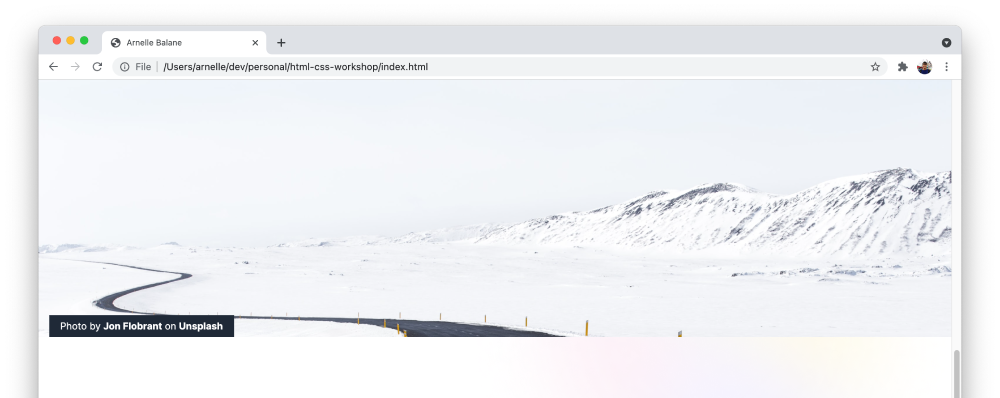

# Absolute and Relative Position

Let's add an attribution to the owner of the photo that we're using as the banner image in our page.

## Add HTML Elements

Update the banner image `<div>` into this:

```html
<div class="banner-image">
  <p class="banner-attribution">
    Photo by <a href="https://unsplash.com/@jonflobrant" target="_blank">Jon Flobrant</a> on
    <a href="https://unsplash.com" target="_blank">Unsplash</a>
  </p>
</div>
```

## Style Attribution Elements

Add these CSS rules to `index.css`:

```css
.banner-attribution {
  display: inline-block;
  padding: 8px 16px;
  margin: 0;

  font-size: 14px;
  line-height: 16px;
  color: #ffffff;
  background-color: #1f2937;
}

.banner-attribution a {
  font-weight: bold;
  text-decoration: none;
  color: #ffffff;
}
```

## Position the Attribution Elements

We want to place the attribution at the bottom-left corner of the banner image. Let's use **absolute positioning** for that:

```css
.banner-attribution {
  position: absolute;
  left: 16px;
  bottom: 0;
}
```

For now it's positioning is off, as it's being positioned relative to the entire browser width and height. In order to contain an absolute-positioned element within its parent element (i.e. to contain the attribution within the banner image), the parent element needs to have **relative positioning**:

```css
.banner-image {
  position: relative;
}
```



We can also see that as we scroll, the banner image covers the site header. Add this styles to the site header to make sure it stays above the other elements.

```css
.site-header {
  z-index: 1;
}
```

## Additional Links

- [Complete code for HTML file](https://github.com/arnellebalane/skourse-html-css-workshop/blob/10-position/index.html)
- [Complete code for CSS file](https://github.com/arnellebalane/skourse-html-css-workshop/blob/10-position/index.css)
