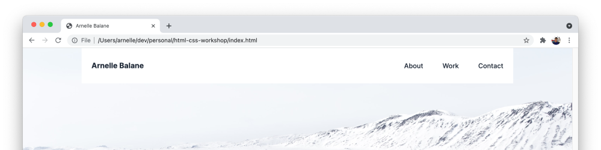
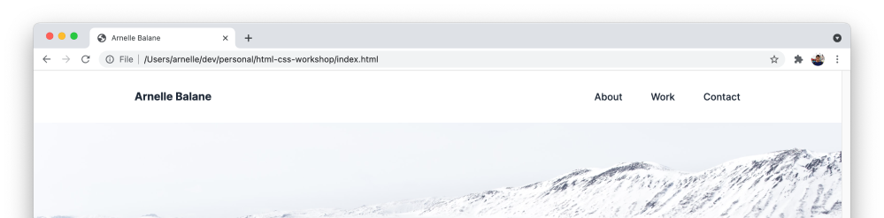

# Sticky Position

Another element that we can keep visible while scrolling is the site header. We'll take a different approach this time and use use **sticky positioning**.

Add these CSS rules into `index.css`:

```css
.site-header {
  position: sticky;
  top: 0;
  background-color: #ffffff;
}
```

This gives us an interesting result, making the site header stick on scroll while also being horizontally-centered due to a `max-width` property that we set earlier.



If we want the header to take up the whole width of the page, while at the same time still centering its contents, we need to add a new element inside it:

```html
<header class="site-header">
  <div class="site-header-contents">
    <a href="/" class="site-logo">Arnelle Balane</a>

    <nav class="site-nav">
      <a href="#about">About</a>
      <a href="#work">Work</a>
      <a href="#contact">Contact</a>
    </nav>
  </div>
</header>
```

Then we move the Flexbox layout styles from `.site-header` into `.site-header-contents`:

```css
.site-header {
  position: sticky;
  top: 0;
  background-color: #ffffff;
}

.site-header-contents {
  display: flex;
  justify-content: space-between;
  align-items: center;

  max-width: 1000px;
  height: 86px;
  padding: 0 24px;
  margin: 0 auto;
}
```


