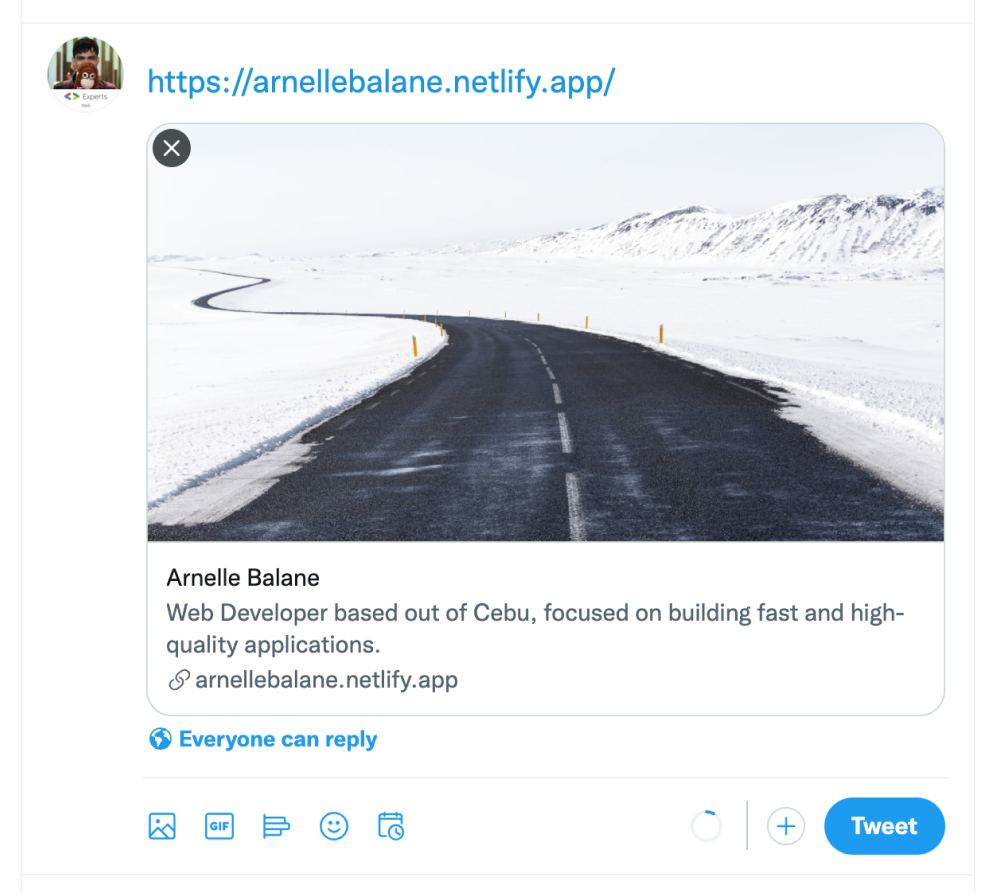

# Sharing

Ever wondered how when we share links in social media there is a preview of the link included in our post?


This is not difficult to do, so let's add this to our personal porfolio site to impress our friends even more!

Add the following inside the `<head>` element, after where we loaded the favicon:

```html
<meta property="og:title" content="Arnelle Balane" />
<meta
  property="og:description"
  content="Web Developer based out of Cebu, focused on building fast and high-quality applications."
/>
<meta property="og:image" content="https://arnellebalane.netlify.app/images/share.jpg" />
<meta property="og:url" content="https://arnellebalane.netlify.app/" />
<meta name="twitter:card" content="summary_large_image" />
```

Feel free to personalize the `content` value for these properties: `og:title`, `og:description`, `og:image`, and `og:url`.



Now, we can share our site to the world!
